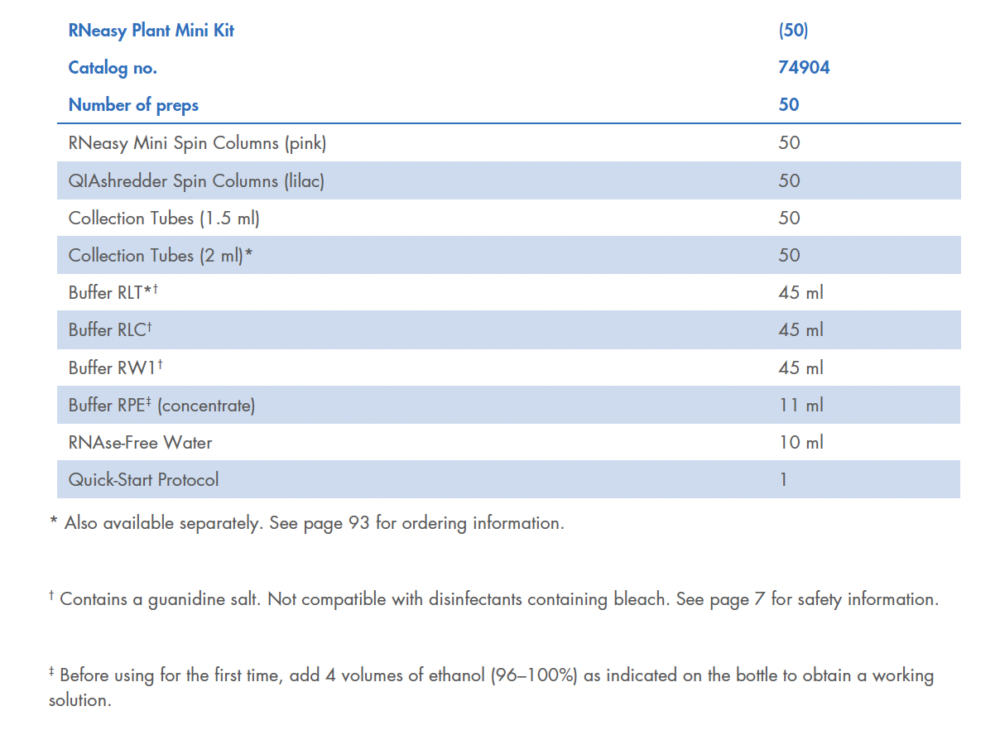
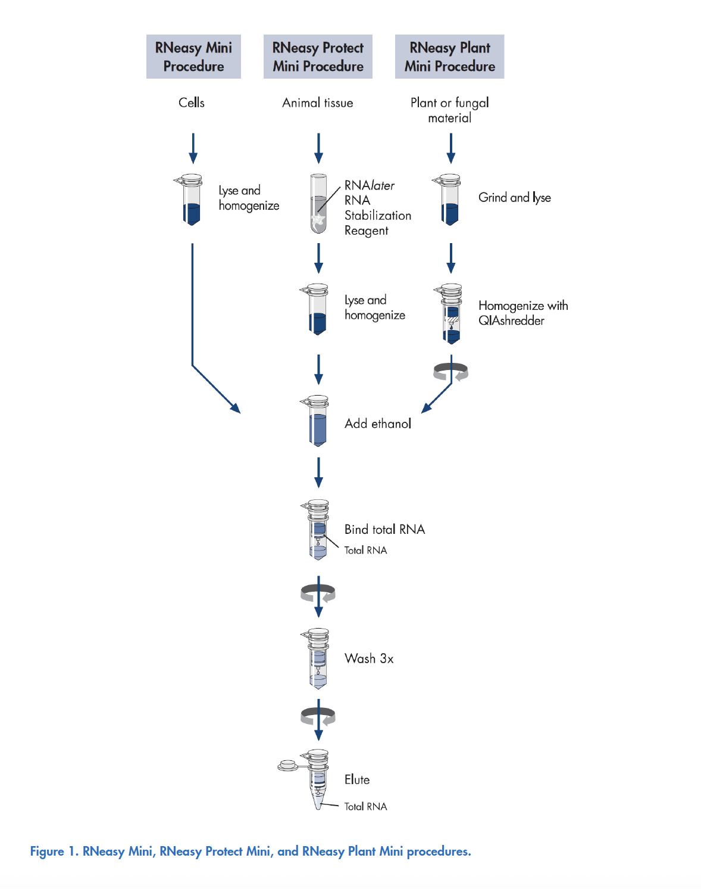

# Purification of Total RNA from Plant Cells and Tissues and Filamentous Fungi

This has been modified from the PDF protocol provided by Qiagen. Check the [PDF version](https://www.qiagen.com/de/resources/download.aspx?id=f646813a-efbb-4672-9ae3-e665b3045b2b&lang=en) for full accuracy. 

This protocol requires the RNeasy Plant Mini Kit.

## Determining the correct amount of starting material

It is essential to use the correct amount of starting material in order to obtain optimal RNA yield and purity. A maximum amount of 100 mg plant material or 1 x 10^7 cells can generally be processed. For most plant materials, the RNA binding capacity of the RNeasy spin column and the lysing capacity of Buffer RLT will not be exceeded by these amounts. Average RNA yields from various plant materials are given in Table 2 (page 20).

If there is no information about the nature of your starting material, we recommend starting with no more than 50 mg plant material or 3–4 x 10^6 cells. Depending on RNA yield and purity, it may be possible to use up to 100 mg plant material or up to 1 x 10^7 cells in subsequent preparations. Do not overload the RNeasy spin column, as this will significantly reduce RNA yield and quality.

Counting cells or weighing tissue is the most accurate way to quantitate the amount of starting material. As a guide, a 1.5 cm diameter leaf disc weighs 25–75 mg.

### Important points before starting

- If using the RNeasy Plant Mini Kit for the first time, read [“Important Notes”](https://www.qiagen.com/de/resources/download.aspx?id=f646813a-efbb-4672-9ae3-e665b3045b2b&lang=en) (page 19).
- If working with RNA for the first time, read [Appendix A](https://www.qiagen.com/de/resources/download.aspx?id=f646813a-efbb-4672-9ae3-e665b3045b2b&lang=en) (page 73).
- Fresh or frozen tissues can be used. Tissues can be stored at −90 to −65°C for several months. Flash-freeze tissues in liquid nitrogen, and immediately transfer to −90 to −65°C. Do not allow tissues to thaw during weighing or handling prior to disruption in Buffer RLT.
- Homogenized tissue lysates from step 4 can also be stored at −90 to −65°C for several months. Incubate frozen lysates at 37°C in a water bath until completely thawed and salts are dissolved before continuing with step 5. Avoid prolonged incubation, which may compromise RNA integrity.
- The RNeasy Plant Mini Kit provides a choice of lysis buffers: Buffer RLT and Buffer RLC, which contain guanidine thiocyanate and guanidine hydrochloride, respectively. In most cases, Buffer RLT is the lysis buffer of choice due to the greater cell disruption and denaturation properties of guanidine thiocyanate. However, depending on the amount and type of secondary metabolites in some tissues (such as milky endosperm of maize or mycelia of filamentous fungi), guanidine thiocyanate can cause solidification of the sample, making extraction of RNA impossible. In these cases, Buffer RLC should be used.
- Buffer RLT may form a precipitate upon storage. If necessary, redissolve by warming, and then place at room temperature. Buffer RLT, Buffer RLC, and Buffer RW1 contain a guanidine salt and are therefore not compatible with disinfecting reagents containing bleach. See page 7 for safety information.
- Perform all steps of the procedure at room temperature. During the procedure, work quickly. Perform all centrifugation steps at 20–25°C in a standard microcentrifuge. Ensure that the centrifuge does not cool below 20°C.

### Things to do before starting

- β-Mercaptoethanol (β-ME) must be added to Buffer RLT or Buffer RLC before use. Add 10 μl β-ME per 1 ml Buffer RLT or Buffer RLC. Dispense in a fume hood and wear appropriate protective clothing. Buffer RLT or Buffer RLC containing β-ME can be stored at room temperature for up to 1 month.
- Buffer RPE is supplied as a concentrate. Before using for the first time, add 4 volumes of ethanol (96–100%) as indicated on the bottle to obtain a working solution.
- If performing optional on-column DNase digestion, prepare DNase I stock solution as described in Appendix D (page 84).

## Procedure

1. Determine the amount of plant material. Do not use more than 100 mg. Weighing tissue is the most accurate way to determine the amount.
2. Immediately place the weighed tissue in liquid nitrogen, and grind thoroughly with a mortar and pestle. Decant tissue powder and liquid nitrogen into an RNAse-free, liquid-nitrogen–cooled, 2 ml microcentrifuge tube (not supplied). Allow the liquid nitrogen to evaporate, but do not allow the tissue to thaw. Proceed immediately to step 3.

   **Note:** RNA in plant tissues is not protected until the tissues are flash-frozen in liquid nitrogen. Frozen tissues should not be allowed to thaw during handling. The relevant procedures should be carried out as quickly as possible.

3. Add 450 μl Buffer RLT or Buffer RLC (see [“Important points before starting”](https://www.qiagen.com/de/resources/download.aspx?id=f646813a-efbb-4672-9ae3-e665b3045b2b&lang=en)) to a maximum of 100 mg tissue powder. Vortex vigorously. A short 1–3 min incubation at 56°C may help to disrupt the tissue. However, do not incubate samples with a high starch content at elevated temperatures, otherwise swelling of the sample will occur.
   
   **Note:** Ensure that β-ME is added to Buffer RLT or Buffer RLC before use (see [“Things to do before starting”](https://www.qiagen.com/de/resources/download.aspx?id=f646813a-efbb-4672-9ae3-e665b3045b2b&lang=en)).

4. Transfer the lysate to a QIAshredder spin column (lilac) placed in a 2 ml collection tube, and centrifuge for 2 min at full speed. Carefully transfer the supernatant of the flow-through to a new microcentrifuge tube (not supplied) without disturbing the cell-debris pellet in the collection tube. Use only this supernatant in subsequent steps.
   
   **Note:** It may be necessary to cut off the end of the pipette tip to facilitate pipetting of the lysate into the QIAshredder spin column. Centrifugation through the QIAshredder spin column removes cell debris and simultaneously homogenizes the lysate. While most of the cell debris is retained on the QIAshredder spin column, a very small amount of cell debris will pass through and form a pellet in the collection tube. Be careful not to disturb this pellet when transferring the lysate to the new microcentrifuge tube.

5. Add 0.5 volume of ethanol (96–100%) to the cleared lysate, and mix immediately by pipetting. Do not centrifuge. Proceed immediately to step 6.
   
   **Note:** The volume of lysate may be less than 450 μl due to loss during homogenization. Precipitates may be visible after addition of ethanol. This does not affect the procedure.

6. Transfer the sample (usually 650 μl), including any precipitate that may have formed, to an RNeasy spin column (pink) placed in a 2 ml collection tube (supplied). Close the lid gently, and centrifuge for 15 s at ≥8000 x g (≥10,000 rpm). Discard the flow-through.
   
   **Reuse the collection tube in step 7.** If the sample volume exceeds 700 μl, centrifuge successive aliquots in the same RNeasy spin column. Discard the flow-through after each centrifugation.
   
   **Optional:** If performing optional on-column DNase digestion (see [“Eliminating genomic DNA contamination”](https://www.qiagen.com/de/resources/download.aspx?id=f646813a-efbb-4672-9ae3-e665b3045b2b&lang=en), page 26), follow Appendix D (page 84), steps 1–4, after performing this step.

7. Add 700 μl Buffer RW1 to the RNeasy spin column. Close the lid gently, and centrifuge for 15 s at ≥8000 x g (≥10,000 rpm) to wash the spin column membrane. Discard the flow-through. *Reuse the collection tube in step 8.*

   **Note:** After centrifugation, carefully remove the RNeasy spin column from the collection tube so that the column does not contact the flow-through. Be sure to empty the collection tube completely.

   Skip this step if performing optional on-column DNase digestion (page 84).

   *Flow-through contains Buffer RLT, Buffer RLC, or Buffer RW1 and is therefore not compatible with bleach. See [page 6](https://www.qiagen.com/de/resources/download.aspx?id=f646813a-efbb-4672-9ae3-e665b3045b2b&lang=en) for safety information.*

8. Add 500 μl Buffer RPE to the RNeasy spin column. Close the lid gently, and centrifuge for 15 s at ≥8000 x g (≥10,000 rpm) to wash the spin column membrane. Discard the flow-through. *Reuse the collection tube in step 9.*

   **Note:** Buffer RPE is supplied as a concentrate. Ensure that ethanol is added to Buffer RPE before use (see [“Things to do before starting”](https://www.qiagen.com/de/resources/download.aspx?id=f646813a-efbb-4672-9ae3-e665b3045b2b&lang=en)).

9. Add 500 μl Buffer RPE to the RNeasy spin column. Close the lid gently, and centrifuge for 2 min at ≥8000 x g (≥10,000 rpm) to wash the spin column membrane.

   The long centrifugation dries the spin column membrane, ensuring that no ethanol is carried over during RNA elution. Residual ethanol may interfere with downstream reactions.

   **Note:** After centrifugation, carefully remove the RNeasy spin column from the collection tube so that the column does not contact the flow-through. Otherwise, carryover of ethanol will occur.

10. *Optional:* Place the RNeasy spin column in a new 2 ml collection tube (supplied), and discard the old collection tube with the flow-through. Close the lid gently, and centrifuge at full speed for 1 min.

    Perform this step to eliminate any possible carryover of Buffer RPE, or if residual flow-through remains on the outside of the RNeasy spin column after step 9.

11. Place the RNeasy spin column in a new 1.5 ml collection tube (supplied). Add 30–50 μl RNAse-free water directly to the spin column membrane. Close the lid gently, and centrifuge for 1 min at ≥8000 x g (≥10,000 rpm) to elute the RNA.

12. If the expected RNA yield is >30 μg, repeat step 11 using another 30–50 μl RNAse-free water, or using the eluate from step 11 (if high RNA concentration is required). Reuse the collection tube from step 11.

    If using the eluate from step 11, the RNA yield will be 15–30% less than that obtained using a second volume of RNAse-free water, but the final RNA concentration will be higher.
